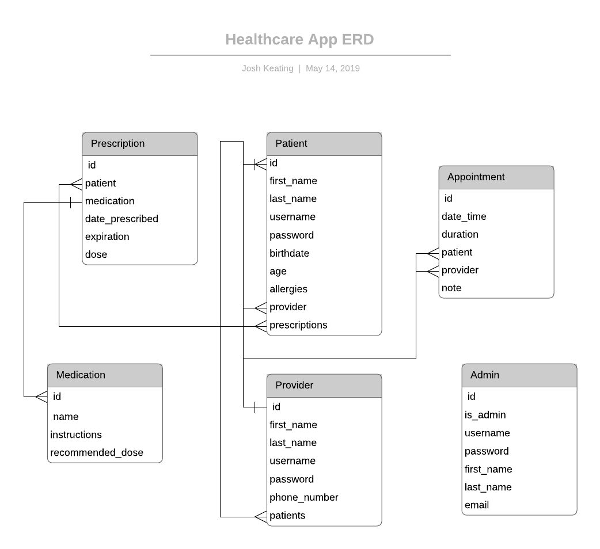

# Healthcare Chat

A Django web application Healthcare communication platform 

## The Database

The application keeps track of three types of users:

 - Patients
 - Providers
 - Admins

Each of these user types are represented as models in the database and each have various levels of privileges.  

## Endpoints

#### MedicationAPI

 - GET
    - returns all medications in the database
    - publicly accessible 
 - POST
    - add medications to the database
    - accessible to `Admin`
 - PATCH
    - update medications in the database
    - accessible to `Admin`

#### PrescriptionAPI

 - GET
    - returns prescriptions in the database
    - accessible to `Admin`, `Provider`, `Patient`
 - POST
    - add prescriptions to the database
    - accessible to `Admin`, `Provider`
 - PATCH
    - update prescriptions in the database
    - accessible to `Admin`

#### AdminAPI

 - GET
    - returns all admins in the database
    - accessible to `Admin`

#### AppointmentAPI

 - GET
    - returns appointments in the database
    - accessible to `Admin`, `Provider`, `Patient`
 - POST
    - add appointments to the database
    - accessible to `Admin`, `Provider`, `Patient`
 - PATCH
    - update appointments in the database
    - accessible to `Admin`
    